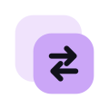

<div align="center">
  <table border="0">
    <tr>
      <td valign="middle">
        
      </td>
      <td valign="middle" style="padding-left: 12px;">
        <h1 style="margin: 0; padding: 0; line-height: 1;">AzAlt</h1>
      </td>
    </tr>
  </table>
</div>

<div align="center">

### **Proqram xərclərini AzAlt** — Pulsuz və Açıq Mənbəli Proqram Alternativləri Kataloqu

[](https://nextjs.org/)
[](https://react.dev/)
[](https://www.typescriptlang.org/)
[](https://tailwindcss.com/)
[](https://catppuccin.com/)
[](LICENSE)

</div>

---

## 📌 Haqqında (About)

AzAlt — baha proqram lisenziyaları və məlumat toplayan xidmətlər əvəzinə tam pulsuz, açıq mənbəli (Open-Source) və məxfilik yönümlü alternativləri bir araya gətirən müasir katalogdur. Məqsədimiz rəqəmsal azadlığı təşviq etmək, fərdi və korporativ proqram xərclərini sıfıra endirməkdir.

### 🎯 Əsas Prinsiplərimiz
- 💰 **Ödənişli lisenziya xərclərini azaltmaq**: Fərdlər və müəssisələr üçün proqram təminatı büdcəsini sıfıra endirmək.
- 🔓 **Açıq mənbəli (Open-Source) azadlıq**: İstifadəçilərin istifadə etdiyi proqram təminatının şəffaflığını və azadlığını təmin etmək.
- 🛡️ **Məxfilik və təhlükəsizlik**: Fərdi məlumatları izləməyən və toplaymayan etibarlı proqram təminatlarını ön plana çıxarmaq.

---

## ✨ Xüsusiyyətlər (Features)

- 🔍 **Ani Axtarış & Filtrləmə**: Proqram adı, əvəz etdiyi ödənişli proqram (məs: *Photoshop*, *Word*) və ya kateqoriya üzrə anında axtarış.
- 🏷️ **Lisenziya Filtrləri**: Açıq Mənbə (Open Source), Pulsuz (Freemium) və ya Şəxsi İstifadə üçün Pulsuz proqramların təsnifatı.
- 🎨 **Catppuccin Mocha Vizual Dizaynı**: Göz yormayan, premium qaranlıq rejim (Dark Mode) və xüsusi rəng palitrası.
- ⚡ **Mikro-Animasiyalar**: Kartların üzərinə gəldikdə yüngül qalxma, Mauve border işıqlanması və məhsulların süzülərək daxil olma effekti.
- 🔝 **İstiqamətləndirici Düymələr**: 300px aşağı sürüşdürdükdə peyda olan hamar **"Back-to-Top"** düyməsi və loqoya kliklədikdə yuxarı hamar keçid.
- ➕ **Resurs Təklif Et Modalı**: İstifadəçilərin yeni proqram alternativləri təklif edə biləcəyi interaktiv modal pəncərəsi.

---

## 🎨 Catppuccin Mocha Theme Palette

AzAlt interfeysi məşhur **Catppuccin Mocha** rəng palitrası əsasında qurulmuşdur:

| Rəng Adı | Hex Kodu | Tətbiq Sahəsi |
| :--- | :--- | :--- |
| **Base** | `#1e1e2e` | Əsas fon rəngi (Background) |
| **Mantle / Card** | `#181825` | Kartlar, Header və Popover fonları |
| **Mauve (Primary)** | `#cba6f7` | Vurğulanan mətnlər, aktiv elementlər, loqo rəngi |
| **Text** | `#cdd6f4` | Əsas mətn rəngi (Foreground) |
| **Green** | `#a6e3a1` | Uğurlu/Lisenziya nişanları |
| **Surface 1** | `#45475a` | Kart kənarlıqları və hover effektləri |

---

## 🛠️ Texnologiya Steki (Tech Stack)

- **Framework**: [Next.js 16 (Turbopack)](https://nextjs.org/) & [React 19](https://react.dev/)
- **Dil**: [TypeScript](https://www.typescriptlang.org/)
- **Stilləndirmə**: [Tailwind CSS v4](https://tailwindcss.com/)
- **İkonlar**: [Lucide React](https://lucide.dev/)
- **UI Komponentləri**: [Shadcn UI](https://ui.shadcn.com/)

---

## 🚀 Lokal İşə Salma (Run Locally)

Layihəni öz kompüterinizdə işə salmaq üçün aşağıdakı addımları izləyin:

```bash
# 1. Repozitoriyanı klonlayın
git clone https://github.com/CyberSweepX/AzAlt.git

# 2. Layihə qovluğuna keçin
cd AzAlt

# 3. Asılılıqları (dependencies) yükləyin
npm install

# 4. İnkişaf serverini işə salın
npm run dev
```

Brauzerinizdə `http://localhost:3000` ünvanına daxil olaraq layihəni görüntüleyin.

---

## 📁 Layihə Strukturu (Project Structure)

```text
az-alt/
├── app/
│   ├── globals.css      # Catppuccin Mocha CSS dəyişənləri və animasiyalar
│   ├── layout.tsx       # Kök layout (Root Layout)
│   └── page.tsx         # Əsas səhifə (Kataloq, Axtarış və Filtrlər)
├── components/
│   ├── az-alt/          # AzAlt xüsusi komponentləri (Header, Cards, BackToTop, Modal)
│   └── ui/              # Baza UI komponentləri (Button, Input)
├── lib/
│   ├── data.ts          # Proqramlar və lisenziya məlumat bazası
│   └── utils.ts         # Qrafik və köməkçi funksiyalar
└── public/              # Statik şəkillər və loqolar
```

---

## 🤝 Töhfə Vermək (Contributing)

Təklifləriniz və ya yeni proqram əlavələriniz var? **Pull Request** açaraq və ya **Issue** yaradaraq layihənin inkişafına töhfə verə bilərsiniz!

---

<div align="center">

Düzəldilib ❤️ ilə **CyberSweepX** tərəfindən.

</div>
